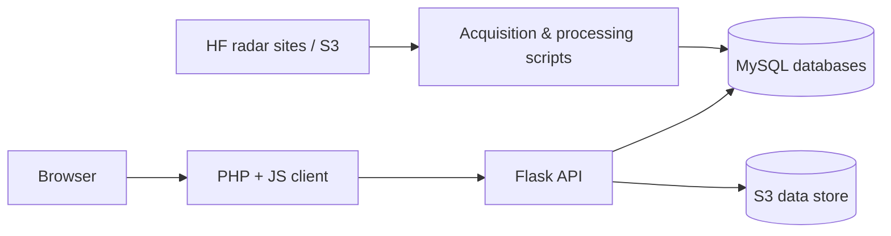

# HFRNet Application

HFRNet (High Frequency Radar Network) is the U.S. national network of shore-based
high-frequency radars that measure ocean surface currents in near real time. This
repository contains the web application used to ingest, serve, and visualize that
data, along with the operational scripts that keep the network's datasets current.

---

## Architecture

The application is made up of three deployable components plus a collection of
operational scripts:

| Component | Path | Stack | Purpose |
|-----------|------|-------|---------|
| Client | [`client/`](./client) | PHP + JavaScript (webpack) | Frontend web app: interactive map of surface currents, diagnostics, and site status views. |
| API | [`api/`](./api) | Python (Flask) | Backend serving radial, total-vector, and wave data endpoints. |
| Database | [`database/`](./database) | MySQL 8.0 | Schema and container for the `hfradar`, `metrics`, `outages`, and `rtvproc` databases. |
| Scripts | [`scripts/`](./scripts) | Python | Operational jobs for data acquisition, metrics, verification, and maintenance. |



---

## Quick Start

Each component is run with its own Docker Compose setup and configured through an
`.env` file. Copy the provided `.env.example` files and fill in your own values
before starting anything.

1. **Database** (start first, since the API and client depend on it):

   ```bash
   cd database
   docker-compose up -d
   ```

2. **API:**

   ```bash
   cd api
   cp .env.example .env   # then edit .env
   docker-compose up --build
   ```

   Serves at `http://localhost:5000`.

3. **Client:**

   ```bash
   cp .env.example .env    # at the repo root; set GOOGLE_MAPS_API_KEY and API_URL
   cd client
   docker-compose up --build
   ```

   Serves at `http://localhost:3000`.

See each component's README for full instructions:
[API README](./api/README.md), [Client README](./client/README.md),
[Database README](./database/README.md).


---

## Disclaimer

This repository is a scientific product and is not official communication of
the National Oceanic and Atmospheric Administration (NOAA), or the United
States Department of Commerce (DOC). All NOAA GitHub project code is provided
on an 'as is' basis and the user assumes responsibility for its use. Any claims
against the DOC or DOC bureaus stemming from the use of this GitHub project
will be governed by all applicable Federal law. Any reference to specific
commercial products, processes, or services by service mark, trademark,
manufacturer, or otherwise, does not constitute or imply their endorsement,
recommendation, or favoring by the DOC. The DOC seal and logo, or the seal and
logo of a DOC bureau, shall not be used in any manner to imply endorsement of
any commercial product or activity by DOC or the United States Government.
